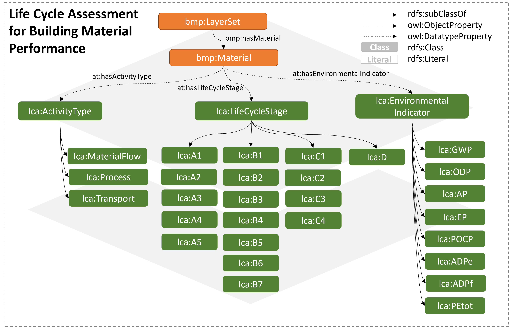

# AT_Archetype Ontology for existig building materials

The Archetype Life Cycle Assessment (LCA) for building engineering domain classifies environmental impact categories, Life Cycel Indicators (LCI), for LCA computaitons.

Web Documentation
https://w3id.org/lca#
HTML documentation https://julkaltenegger.github.io/lca/ 

### Core Ontology

